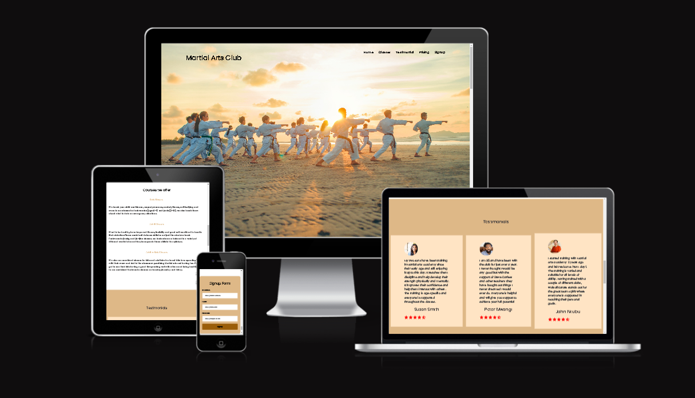
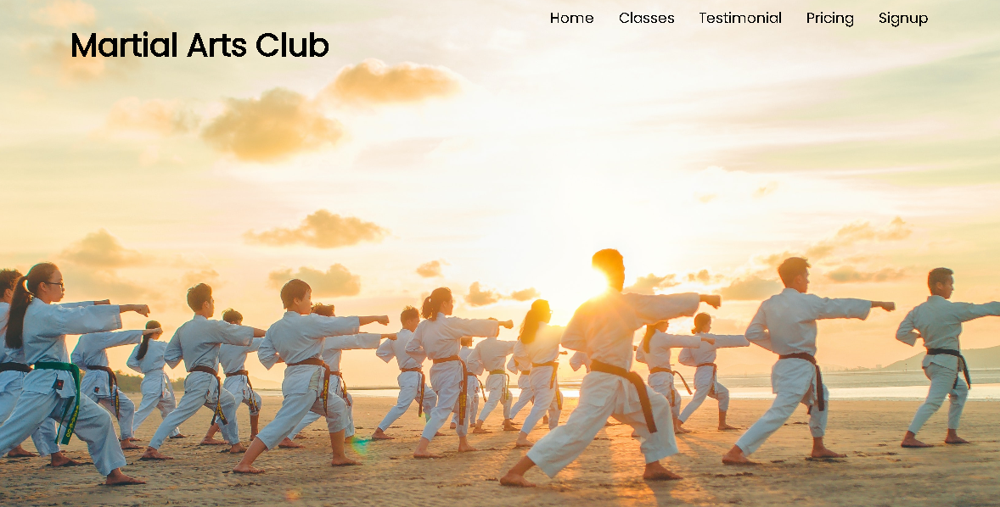
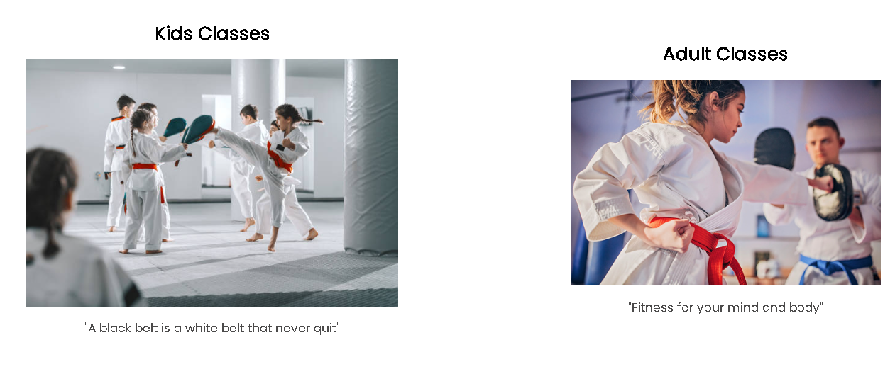
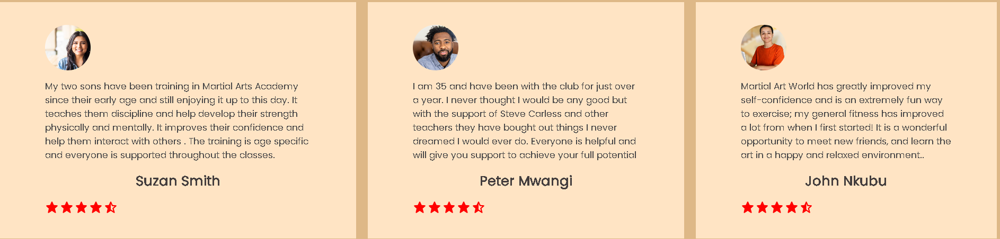
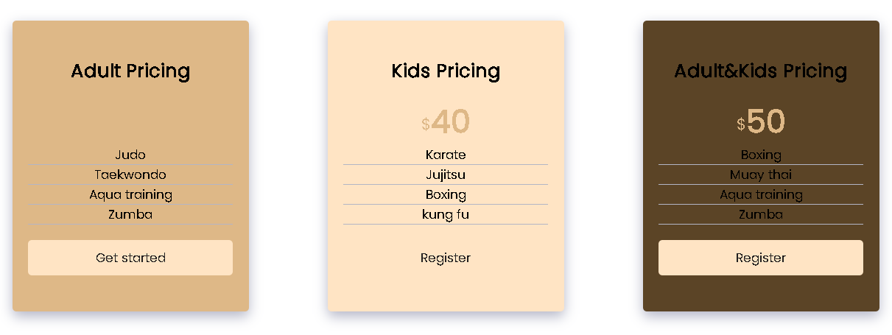
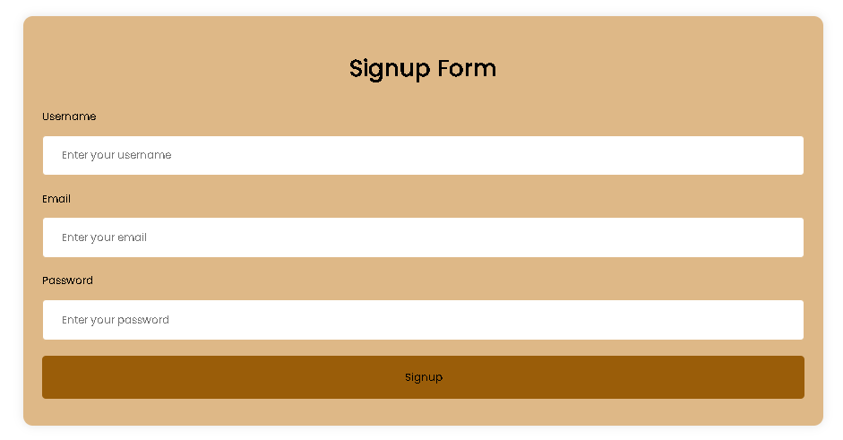
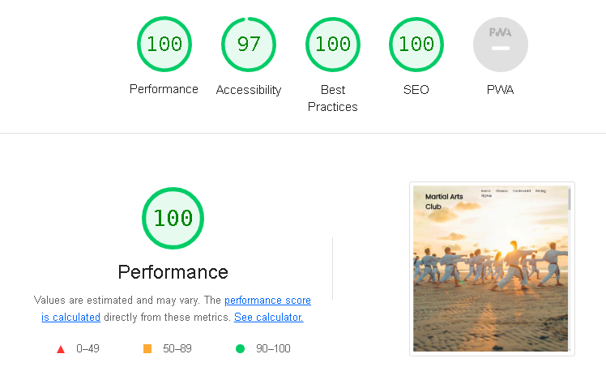

# Martial Arts Club

 

# Features
## Navigation 
* The navigation bar is on the right hand corner and shows us the different link we can go to.
* We have the Home, Classes, Testimonial, Pricing and Signup links.

## Header
* At the Header we can see the Adults and the kids classes training together.
* The header also shows the name of the club and using Burlywood as the color of choise for the project.

## Classes
* In the classes section we can see a picture of kids and Adults training in their respective classes with our trainers hightly motivated.

## Courses we offer
### In this section we see the benefits of martial-arts i.e:
* Martial arts improves self confidence and self-esteem.
* Our training strengthens your body and improves fitness.
* Improves Cardiovascular health because blood vessels expand and ciculation improves.
* Martial arts reduce stress level by doing physical exercise and letting out negative energy in the gym.
* Socializing and meeting new people in the gym with same interests.

# Testimonials 
* The testimonial section shows that our customers are happy with our services.
* Our customers give us credibility and high level of trustworthiness.
* Our happy customers turn into loyal fans.

# Pricing
* Our pricing list show the various packages we have for the kids, adults and adult/kids pricing.
* Our pricing also shows us the costs associated with the groups.
* There are also different methods of training for the various groups.

# Sign-up
* The sign-up has a form to collect details of the adults and kids.
* The sign-up also has a form validation.

# Contact
* We also have the contact address which shows us the physical address of the club.
* We also have the social media icons i.e facebook, twitter, instagram and youtube in relation with the club.
 

# Testing
* I tested the page works in different browsers.
* The header, navigation, main page, classes, testimonials, pricing, sign-up and contact are legible and easy to understand.
* I have confirmed that the project is responsive across varios screen sizes.
* I have confirmed that the form validates inputs.

# Validator testing

## HTML 
* No were returned when passing through W3C HTML validator.
## CSS
* No errors were found in the W3C CSS validator.
## Accessibility score

# Deployment 
 ## This site was deployed to github pages
 * From Github repository,navigate to the settings tab.
 * From the source section dropdown,select main branch.
 * From the main branch, the page will provide the link to the completed website.

 # Credits
 ## Content
 * Code institue LoveRunnning project for the footer section.
 * Coding club read me for inspiration.

 # Media 
 * The media images were taken from Google.
 

